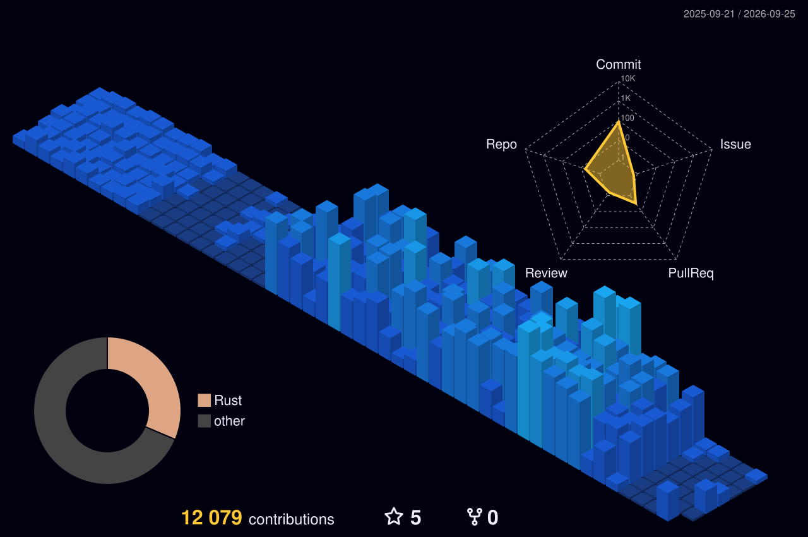

<!--
  PROFILE README HUB — github.com/SA-Ark  ·  identity: "Ark" <engineering@chakrakali.com>
  Stats self-hosted via lowlighter/metrics -> output branch (.github/workflows/metrics.yml).
  keywords for search: AI Engineer, Machine Learning, LLM, RAG, multi-agent systems, agentic AI,
  LLM orchestration, pgvector, vector database, semantic search, knowledge graph, distributed systems,
  AI infrastructure, Rust, TypeScript, Python, PostgreSQL, Next.js, MLOps.
-->

<!-- Banner carries the name; the bare <h1>Ark</h1> is intentionally replaced by this. -->

  

  One engineer running a <b>120+ service</b> production AI platform, mostly in Rust — multi-agent
  orchestration, RAG and search over vector databases, and GPU media pipelines. 
  I also design and build the front of house: fast, accessible Next.js interfaces with an
  AI-enhanced design system, so the same person owns the model, the infrastructure, and the pixels.  
  <b>Anyone can ship a demo. I build the system that's still standing eighteen months later.</b>

  <a href="https://ark.chakrakali.com"><b>ark.chakrakali.com</b></a>
  &nbsp;·&nbsp; <a href="mailto:engineering@chakrakali.com">engineering@chakrakali.com</a>
  &nbsp;·&nbsp; open to a few remote contract / consulting engagements

---

### What I'd point you at first

- **[portfolio](https://github.com/SA-Ark/portfolio)** — the map of the whole estate: the architecture, how one person runs 120+ services, and links to every live demo. Start here.
- **[nexus](https://github.com/SA-Ark/nexus)** — how I keep a fleet of AI agents from falling over. Work runs off a dependency graph, a stalled agent is caught by evidence rather than a timeout and retried, and anything genuinely risky stops to ask a human. [Watch it run →](https://nexus.chakrakali.com)
- **[aegis](https://github.com/SA-Ark/aegis)** — a Rust CLI that grades a codebase or a live URL the way I would on day one of a rescue: leaked secrets, shaky dependencies, untested critical paths, sloppy config. One binary, one score. `cargo install aegis-audit`
- **[mindvault](https://github.com/SA-Ark/mindvault)** — the memory layer behind my agents. Hybrid recall (BM25 + vectors, fused) over a knowledge graph on pgvector, and no retrieval change ships without the eval harness proving it (recall@k, MRR, latency).
- **[scour](https://github.com/SA-Ark/scour)** — the search primitives underneath that, pulled into a zero-dependency Rust crate: BM25, HNSW, reciprocal-rank fusion, and chunking that never splits a UTF-8 character. [Live demo →](https://scour.chakrakali.com) · `cargo add scour-search`
- **[crucible](https://github.com/SA-Ark/crucible)** — an evaluation harness for LLM and RAG systems. Score what your model actually returned against ground truth — recall@k, MRR, nDCG, token-F1 — with pass/fail thresholds that drop straight into CI. `cargo install crucible-eval`

---

---

<!-- lowlighter/metrics: single pre-rendered dark SVGs, no light variant exists — left as-is. -->

---

<!-- Activity graph: real light/dark variants, so it theme-switches with the viewer's GitHub theme. -->
<picture>
  <source media="(prefers-color-scheme: dark)" srcset="https://github-readme-activity-graph.vercel.app/graph?username=SA-Ark&theme=github-dark&hide_border=true&area=true&custom_title=Contribution%20activity" />
  <source media="(prefers-color-scheme: light)" srcset="https://github-readme-activity-graph.vercel.app/graph?username=SA-Ark&theme=github-light&hide_border=true&area=true&custom_title=Contribution%20activity" />
  
</picture>

---

<!-- 3D isometric contribution calendar, generated daily by .github/workflows/profile-3d.yml. -->
<!-- 404s until the Action first runs; the supervisor triggers it. -->

---

### How I work

The industry has gotten very good at selling the demo. A model that shines in a notebook, an agent that performs once on a launch stage — and then comes apart the first week it meets real customers, real load, and a real invoice. Dazzling in five minutes, unaccountable over eighteen months. That gap between the pitch and the operation is where most AI budgets quietly disappear.

My work lives on the other side of that gap. A system isn't finished when the code runs — it's finished when it survives real use on the live product, because standing something up is the cheap part and keeping it upright is the part a business is actually paying for. I don't claim a capability I can't show you running with the numbers behind it, so what you're buying is a measured outcome rather than a slide. And when something breaks — it always eventually does — I spend the time to find why instead of quieting the symptom, because the shortcut that saves an afternoon today is the customer-facing outage next quarter. What you're left holding is a system that grows more dependable the longer it runs, not one that decays the moment I walk away.

### Selected design work

A live gallery of production-grade interface designs across industries — one codebase, many products, each built with an AI-enhanced design system that owns type, motion, and layout end to end. **[Explore the live, interactive gallery →](https://ark.chakrakali.com/designs)**

<table>
<tr>
<td width="420" align="center">
   
  <b>E-commerce</b> · AURUM Atelier — luxury storefront + 3D configurator
</td>
<td width="420" align="center">
   
  <b>Fintech</b> · NORTHWIND — private bank, floating 3D metal card
</td>
</tr>
<tr>
<td width="420" align="center">
   
  <b>SaaS</b> · PULSEGRID — product analytics with live charts
</td>
<td width="420" align="center">
   
  <b>Healthcare</b> · WILLOW Health — calm clinic + booking flow
</td>
</tr>
<tr>
<td width="420" align="center">
   
  <b>Dev Tools</b> · TORQUE — CI/CD with a self-typing terminal
</td>
<td width="420" align="center">
   
  <b>Music</b> · VOLTA — lossless player with live visualizer
</td>
</tr>
<tr>
<td width="420" align="center" colspan="2">
   
  <b>Travel</b> · VELA Voyages — editorial, film-backed itineraries
</td>
</tr>
</table>

Seven of twelve industries · <a href="https://ark.chakrakali.com/designs">see all twelve, interactive →</a>

---

### Stack

**Languages** · Rust · TypeScript · Python · SQL

**AI / ML** · LLM orchestration · multi-agent systems · RAG · vector search · knowledge graphs · pgvector · embeddings · GPU inference · MLOps

**Backend / Data** · Axum · Tokio · PostgreSQL · Redis · Qdrant · REST APIs · WebSockets · async / concurrent systems

**Infra / Ops** · Docker · Linux · systemd · Cloudflare · CI/CD · observability · self-hosted fleet · Model Context Protocol (MCP)

**Frontend / Design** · Next.js · React · Tailwind CSS · design systems · motion / micro-interactions · accessibility (WCAG) · responsive UI · AI-assisted design tooling · data visualization

  

